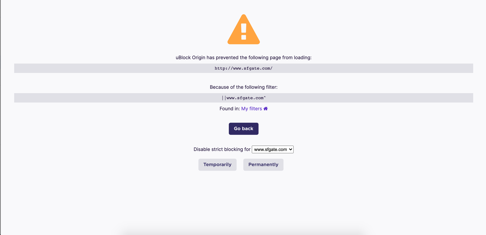

# uBlockFilters
OregonCharterFilters.txt contains blocked and allowed websites that are automatically loaded for each Chromebook upon login. 

## How this filter works:
Adding a domain to the filter will initially block the entire site from view and offer an option to turn this off. 

Blocking a specific element within the page will block that element for all students

Ex: oregoncharter.zoom.us###navbar

_This blocks the navigation bar on oregoncharter.zoom.us_

To allow a website, use the following syntax

@@||example.com

The above will allow all assets and pages from the domain _example.com_. If there are any additional advertisements or assets hosted on that page, these may be blocked as they're not originating from _example.com_.
